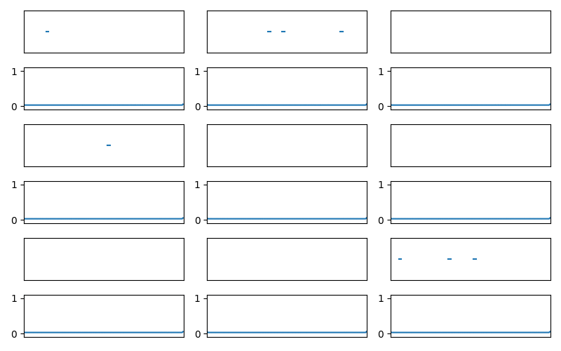

# Speaker Change Detection (and Segmentation)

> Implementation of ["End-to-end speaker segmentation for overlap-aware resegmentation"](https://arxiv.org/abs/2104.04045) with modifications for speaker change detection. Learn more in the [presentation](./media/Speaker%20Change%20Detection%20Presentation.pdf).

    

This code is based on [pyannote/pyannote-audio](https://github.com/pyannote/pyannote-audio/). Some functions are identical to those in `pyannote.audio`, some are slightly modified, and some are heavily modified. Additionally, there is novel code to perform speaker change detection and to connect everything together.

This code can prepare data, train, and perform inference for two different tasks: speaker change detection and speaker segmentation. However, the outputs from both models/configurations can be processed into speaker change points.

**Model Weights** (including short_scd_bigdata.ckpt): [Available from this HuggingFace repo](https://huggingface.co/HHousen/speaker-change-detection/tree/main).

Training GIFs (more details in the [presentation](./media/Speaker%20Change%20Detection%20Presentation.pdf)):

Speaker Change Detection | Segmentation
:-----------------------:|:--------------------:
 | 

Speaker change detection identifies timestamps where the active speaker changes. If someone starts speaking, stops speaking, and starting speaking again (and no one else started speaking while they were not speaking), no speaker change occurs. If two people are speaking and one of them stops or another person starts speaking, a speaker change occurs. See slide 6 of [the presentation](./media/Speaker%20Change%20Detection%20Presentation.pdf).

Segmentation splits a conversation into turns. It identifies when people are speaking. This is not voice activity detection since if multiple people are talking the model will output probabilities indicating multiple speakers. This is not speaker diarization because speakers are not identified for the entire length of an audio file.

The code is mostly organized according to [PyTorch Lightning](https://pytorch-lightning.readthedocs.io/en/latest/)'s structure. Package management is handled by [Poetry](https://python-poetry.org/).

## Setup

The dataset used is the [AMI Meeting Corpus](https://groups.inf.ed.ac.uk/ami/corpus/). It was downloaded and repaired using the scripts available in the [pyannote/AMI-diarization-setup](https://github.com/pyannote/AMI-diarization-setup) GitHub repository.

### Steps

1. Clone the repo: `git clone --recurse-submodules https://github.com/HHousen/speaker-change-detection/ && cd speaker-change-detection`
2. Install requirements and activate environment: `poetry install` then `poetry shell`
3. Download the data: `cd AMI-diarization-setup/pyannote && sh download_ami.sh` ([more details](https://github.com/pyannote/AMI-diarization-setup/blob/67c2d539286e89f68952d5dcf83912bd9f01dfae/pyannote/README.md#how-to-use-in-pyannote))
4. Train a model: `python train.py`. Set `DO_SCD` in [train.py](./train.py) to `True` to do speaker change detection or set it to `False` to do segmentation.
5. Perform inference using [process_file.py](./process_file.py). Replace `short_scd_bigdata.ckpt` with the path to your model checkpoint and `test_audio_similar.wav` with the path to your audio file. Set `DO_SCD` to the same value used for training.

## Script Descriptions

1. `train.py`: Execute to train a model on the dataset. Loads the data using a `SegmentationAndSCDData` datamodule and instantiates a `SSCDModel` model. Logs to Weights and Biases and trains on a GPU using the PyTorch Lightning `Trainer`.
2. `model.py`: Defines the `SSCDModel` model architecture, training loop, optimizers, loss function, etc.
3. `sincnet.py`: An implementation of the SincNet model, which is used in `SSCDModel`, from [this GitHub repo](https://github.com/pyannote/pyannote-audio/blob/develop/pyannote/audio/models/blocks/sincnet.py).
4. `data.py`: Defines the `SegmentationAndSCDData` datamodule, which processes the data into the format accepted by the model. Uses `pyannote.database` to load and do some initial processing of the data.
5. `inference.py`: Contains functions necessary to perform inference on a complete audio file. Can be used easily on a file by running `process_file.py`.
6. `process_file.py`: Processes an audio file end-to-end using the `Inference` object defined in `inference.py`.
7. `process_file.ipynb`: Similar to `process_file.py`, but as a Jupyter notebook to take advantage of `pyannote.core`'s plotting functions.

Note: `database.yml` tells `pyannote.database` where the data is located.

## Future Research

* Train longer, larger model
* Data augmentation to address overfitting
* Tested transformers, but performed worse than LSTM.
  * LSTM ROC AUC ≈ 90 & Transformer ROC AUC ≈ 80
* SincNet supposedly better than handcrafted features, but should test MFCCs, FBANKs, etc.
* More advanced inference techniques:
  * Remove short gaps in active speaker output
  * Remove segments only active for short time
  * Separate activate and deactivate thresholds

## References

This idea and code are primarily based on the paper ["End-to-end speaker segmentation for overlap-aware resegmentation"](https://arxiv.org/abs/2104.04045) by Hervé Bredin & Antoine Laurent.

Also, SincNet is a key component of the model architecture: ["Speaker Recognition From Raw Waveform With Sincnet"](https://arxiv.org/abs/1808.00158) by Mirco Ravanelli, Yoshua Bengio
